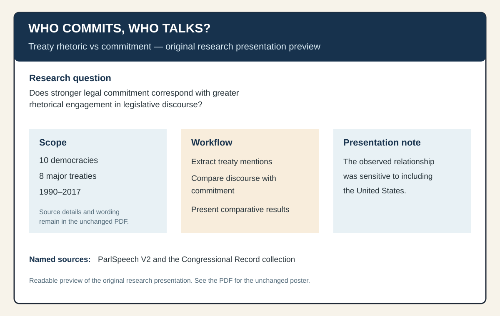

# Treaty Classification Tool

[](https://github.com/m1k3datx/TreatyClassificationTool/actions/workflows/ci.yml)

Developed a Python treaty-analysis workflow used in my research project, Who Commits, Who Talks?, examining the relationship between international treaty commitment and legislative discourse. The project has since been improved with explainable classification rules, input validation, automated tests, and continuous integration.



## Research background

The research project asks whether countries that make stronger legal commitments to international treaties also engage with those treaties more actively in legislative discourse. The original presentation compared treaty commitment and treaty mentions across democracies, using the scope and sources documented in the [case study](docs/case-study.md).

## What the current tool does

This repository features an explicit Gemini contextual-analysis workflow and preserves the offline, deterministic rules baseline. Both accept one text or a pipe-delimited/CSV file, check for an explicit target, assign one of the shared stance categories, and return exact evidence excerpts. AI mode sends speech text to Gemini; offline mode makes no network calls and requires no key.

### Gemini AI mode

Install the supported Google Gen AI SDK and configure a key locally (never upload it to GitHub or commit it):

```console
python -m pip install -r requirements.txt
set GEMINI_API_KEY=your-key           # Windows PowerShell: $env:GEMINI_API_KEY="your-key"
python Classifier.py --ai --text "We support the Paris Agreement." --target "Paris Agreement"
python Classifier.py --ai speeches.txt "Paris Agreement" --output ai-results.csv
```

Use `--offline-baseline` for the explicit deterministic comparison workflow (it is also the default for backward compatibility):

```console
python Classifier.py --offline-baseline speeches.txt "Paris Agreement" --output baseline.csv
```

AI responses are constrained to JSON, checked against the allowed categories, and rejected unless every evidence excerpt is an exact non-empty substring of the source passage. Provider failures, missing keys, quota/network errors, malformed responses, and validation failures return an error; AI mode never silently falls back to rules. The prompt directs Gemini to consider target context, quoted or unrelated speech, negation, withdrawal/exit, and conditional language, but this is not a claim of perfect accuracy. AI mode is a local-user workflow and sends the selected speech passage to Google's Gemini service.

## Synthetic example

The following is intentionally synthetic and does not represent a research observation:

```text
Input:  We urge parliament to ratify the Aurora Climate Treaty.
Target: Aurora Climate Treaty
Output: Supporting
Evidence: urge parliament to ratif, ratify
```

Reproduce the example with the current CLI:

```console
python Classifier.py --text "We urge parliament to ratify the Aurora Climate Treaty." --target "Aurora Climate Treaty"
```

The generated output is preserved in [`docs/demo/synthetic-classification-output.txt`](docs/demo/synthetic-classification-output.txt).

## Quick start

Python 3.9+ is required and the classifier uses only the standard library:

```console
python Classifier.py --offline-baseline --text "We urge parliament to ratify the Paris Agreement." --target "Paris Agreement"
python Classifier.py speeches.txt "climate treaty" --output results.csv
python -m unittest discover -s tests -v
```

Input files may be pipe-delimited (`speech_id|text`) or CSV with `Speech_ID` and `Mention` (or `id` and `text`) columns. File processing uses the search term as the target; single-text classification requires an explicit `target`.

## Project documentation

- [Case study](docs/case-study.md): research context, scope, contribution, and limitations.
- [Methodology notes](docs/methodology.md): AI response validation, baseline workflow, and review boundaries.
- [Original research poster](docs/research/original-research-poster.pdf) and [readable preview](docs/research/original-research-poster-preview.svg).
- [Tests](tests/test_classifier.py).

## Limitations

This is an explainable rule-based baseline, not a calibrated statistical model. Mentions and stance labels are not measures of intent, compliance, or symbolic behavior. Results depend on the supplied target phrase and source text, and ambiguous cases are returned as `Needs review`.
